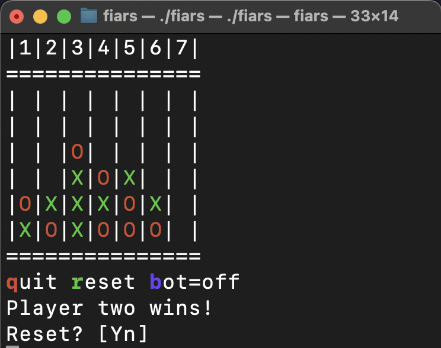

# Fiars

Fiars stands for "Four in a Row", which is how we call Connect Four in Dutch (translated). The suffix RS in fiaRS is because it's written in Rust.

## Requirements

To run this project, you need to have [Rust](https://www.rust-lang.org/) and [Cargo](https://doc.rust-lang.org/cargo/) installed. Cargo is the Rust package manager and build system.

## Running the Project

To run the project, use the following command:

```sh
cargo run
```

## Building the Project

To build the project in release mode, use the following command:

```sh
cargo build --release
```

To further reduce the size of the executable, you can use the `strip` command:

```sh
strip target/release/fiars
```

## Usage
Usage
To run the `fiars` program, open your terminal and navigate to the directory containing the `fiars` executable. Then, execute the following command:

```sh
./fiars
# or fiars.exe
```

Once the program is running, you can interact with it using the following commands:
- q: Quit the program.
- r: Reset the game.
- b: Toggle the bot mode. The available modes are:
    - Off
    - Easy
    - Normal
    - Difficult
    - Expert
- 1-7: Choose a row (from 1 to 7) to make a move.
- CTRL-C: Force quit the program.
These commands allow you to control the game and interact with the bot in various difficulty levels.

## Screenshots

